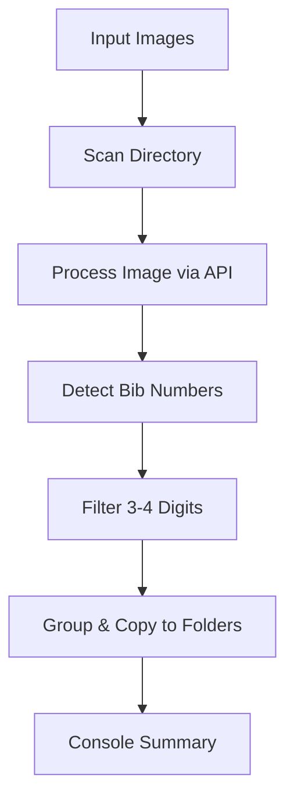

# Race Number Radar

[](https://opensource.org/licenses/MIT)
[](https://www.python.org/downloads/)
[](https://typer.tiangolo.com/)

**Race Number Radar** is a powerful Python tool designed to streamline race photo organization by automatically detecting bib numbers in images using state-of-the-art vision-language AI models. Perfect for race organizers, photographers, or event enthusiasts, it eliminates tedious manual sorting by grouping photos into folders based on detected runner bib numbers.

Optimized for performance with concurrent processing, robust error handling, and a sleek CLI powered by [Rich](https://github.com/Textualize/rich), it integrates seamlessly with [OpenRouter](https://openrouter.ai/) for AI-driven number detection. Whether you're processing 10 or 10,000 images, this tool delivers speed and reliability.

🚀 **Key Features:**
- **AI-Powered Detection**: Leverages multimodal AI (default: `qwen/qwen2.5-vl-32b-instruct`) to identify 3-4 digit bib numbers.
- **High Performance**: Concurrent processing with adjustable workers (default: `8`) and image resizing for efficiency.
- **Retry Logic**: Robust error handling with exponential backoff for API failures.
- **Configurable**: Customize via CLI or persistent config.json for model, workers, and bib length.
- **Image Optimization**: Auto-resizes and compresses images to fit API limits (default: 1.5MB).
- **Organized Output**: Copies images into subfolders (e.g., `./123/`, `./456/`) by bib number.
- **Rich CLI**: Vibrant progress bars and colored logs for a polished user experience.

This project was born from the need to streamline post-race photo management—check out the demo below and see how it transforms chaos into order!

## 📸 Demo

  

### Sample Terminal Output (with Rich Formatting)
The tool provides vibrant, real-time feedback. Here's what it looks like when running:

```
Processing 50 files in /path/to/images with 64 workers...
File: runner_001.jpg -> Detected: 123
File: crowd_shot.jpg -> Detected: 456, 789
Processing... 100%|██████████| 50/50 [00:45<00:00, 1.11it/s]

--- Organizing files ---
Organized 3 image(s) for number 123 into '/path/to/images/123'
Organized 2 image(s) for number 456 into '/path/to/images/456'
```

## 🛠️ Installation

1. **Clone the Repository**:
   ```
   git clone https://github.com/MichalZak17/Race-Number-Radar.git
   cd Race-Number-Radar
   ```

2. **Set Up Virtual Environment**:
   ```
   python -m venv venv
   source venv/bin/activate  # On Windows: venv\Scripts\activate
   ```

3. **Install Dependencies**:
   ```
   pip install -r requirements.txt
   ```
   *requirements.txt includes: `typer`, `rich`, `Pillow`, `python-dotenv`, `openai`, `concurrent.futures` (standard lib).*

4. **Environment Setup**:
   Create a `.env` file in the root:
   ```
   OPENROUTER_API_KEY=your_api_key_here
   ```
   Get your API key from [OpenRouter](https://openrouter.ai/keys) (free signup required).

## ⚙️ Configuration

Race Number Radar is designed for ease of use with flexible configuration. Defaults are optimized for performance, but you can tweak settings via CLI or `config.json`.

### Using `config.json`
View current settings with:
```
python run.py view-config
```
Update settings with:
```
python run.py set-config --workers 16 --min-bib-len 3 --max-bib-len 4 --api-model "qwen/qwen2.5-vl-32b-instruct" --max-size-kb 1500
```

Example `config.json`:
```json
{
    "api_model": "qwen/qwen2.5-vl-32b-instruct",
    "workers": 8,
    "min_bib_len": 3,
    "max_bib_len": 4,
    "max_size_kb": 1500
}
```

-   **api_model**: Vision-language model (default: `qwen/qwen2.5-vl-32b-instruct`).
-   **workers**: Concurrent threads (default: `8`; adjust based on CPU and API limits).
-   **min_bib_len / max_bib_len**: Bib number digit range (default: `3-4`).
-   **max_size_kb**: Image compression limit for API (default: `1500KB`).

CLI overrides config (e.g., `python run.py process /images --workers 16`).

### API Configuration: OpenRouter Integration

This tool uses [OpenRouter.ai](https://openrouter.ai/) as the backend for AI inference — a unified API for 100+ models from providers like DeepInfra, Anthropic, and more. It's pay-as-you-go with generous free tiers.

#### Getting Started with OpenRouter
1. **Sign Up**: Create a free account at [openrouter.ai](https://openrouter.ai/).
2. **API Key**: Go to [openrouter.ai/keys](https://openrouter.ai/keys), create a new key, and add it to your `.env` as `OPENROUTER_API_KEY`.

#### Pricing & Costs
- **Model Used**: `qwen/qwen2.5-vl-32b-instruct` (free tier available!).
  - **Input/Output Cost**: $0 per 1M tokens (free model). Vision inputs count toward token usage based on image resolution.
  - **Provider**: Defaults to `deepinfra/bf16` for efficiency.
- **General Pricing**: 
  - Free models: No cost, but limited usage.
  - Paid models: $0.0001–$0.01+ per 1K tokens (varies; check [openrouter.ai/models](https://openrouter.ai/models) for latest).
  - Images: Encoded as base64; larger images increase token count (tool auto-compresses to ~1.5MB).
- **Estimated Cost Example**: Processing 100 images (avg. 1K tokens each) on free model: $0. But if switching to a paid VL model like GPT-4o: ~$0.01–$0.05 total.
- **Billing**: Prepay credits; no surprises. Track usage in your dashboard.

**Pro Tip**: Start with the free Qwen model—it's excellent for bib detection and costs nothing!

## 🚀 Usage

Run `python run.py --help` for full options.

### Basic Processing
```
python run.py process /path/to/image/directory
```
- Scans for `.jpg`, `.jpeg`, `.png`, `.webp` files.
- Detects bib numbers (3-4 digits by default).
- Creates subfolders like `001/`, `123/` and copies images there.
- No detections? Images stay in the root (tool skips empty responses).

### Advanced Examples
- Override settings: `python run.py process /images --workers 32 --min-bib-len 2 --max-bib-len 5`
- View config: `python run.py view-config`
- Set config: `python run.py set-config --max-size-kb 2000`

#### Full Help Output
**Main Help**:
```
 Usage: run.py [OPTIONS] COMMAND [ARGS]...

╭─ Options ─────────────────────────────────────────────────────────────────────────────────────────────────────────────────╮
│ --install-completion          Install completion for the current shell.                                                   │
│ --show-completion             Show completion for the current shell, to copy it or customize the installation.            │
│ --help                        Show this message and exit.                                                                 │
╰───────────────────────────────────────────────────────────────────────────────────────────────────────────────────────────╯
╭─ Commands ────────────────────────────────────────────────────────────────────────────────────────────────────────────────╮
│ process       Processes a directory of images to detect race numbers using an OpenAI-powered client, organizes images by  │
│               detected numbers, and copies them into corresponding subdirectories. ... (truncated for brevity)            │
│ set-config    Sets configuration values and saves them to config.json.                                                    │
│ view-config   Displays the current configuration from config.json.                                                        │
╰───────────────────────────────────────────────────────────────────────────────────────────────────────────────────────────╯
```

**Process Help**:
```
 Usage: run.py process [OPTIONS] DIRECTORY

 Processes a directory of images... (full description as provided)

╭─ Arguments ───────────────────────────────────────────────────────────────────────────────────────────────────────────────╮
│ *    directory      TEXT  Directory with images to process. [required]                                                    │
╰───────────────────────────────────────────────────────────────────────────────────────────────────────────────────────────╯
╭─ Options ─────────────────────────────────────────────────────────────────────────────────────────────────────────────────╮
│ --api-model          TEXT     API model to use (overrides config).                                                        │
│ --workers            INTEGER  Number of workers (overrides config).                                                       │
│ --min-bib-len        INTEGER  Minimum bib number length (overrides config).                                               │
│ --max-bib-len        INTEGER  Maximum bib number length (overrides config).                                               │
│ --max-size-kb        INTEGER  Max image size in KB for base64 encoding (overrides config).                                │
│ --help                        Show this message and exit.                                                                 │
╰───────────────────────────────────────────────────────────────────────────────────────────────────────────────────────────╯
```

*(For `set-config` and `view-config`, see the code—simple flag-based updates.)*

## 📁 Workflow Diagram


## 🤝 Contributing

Contributions welcome! Fork, PR, or open issues. Tests and docs appreciated.

## 📄 License

This project is licensed under the MIT License - see the [LICENSE](LICENSE) file for details.

## 🙏 Acknowledgments

- [OpenRouter.ai](https://openrouter.ai/) for the awesome API.
- [Rich](https://github.com/Textualize/rich) for beautiful terminals.
- [Typer](https://typer.tiangolo.com/) for CLI magic.
- Qwen Team for the VL model.

**Connect on LinkedIn**: Share your race photo sorting wins! Tag me [@michalzak000](https://www.linkedin.com/in/michalzak000/).